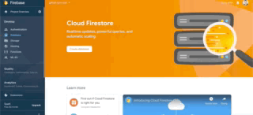
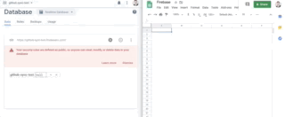

# Sync Firebase With Google Sheets

## Overview

### Purpose

- To provide a simple method to syncronise a Google Sheet file with a Realtime Database.
- Google Sheets provides a simple interface for non-programmers to add, edit and delete data whilst the Firebase API provides an effective interface to make programmatic read/write request to the data.

### Features

- Multiple sheets.
- Add/remove cells, columns or rows as you normally would.
- Single cell updates (Firebase --> Sheets).
- Authentication: you can restrict access to sheet to limited number of users.

### Testing

- The project aims for approximately 85-90% test coverage.
- Any contributions should include necessary tests.

## Getting Started

#### Installations

- Clone repo
- `yarn install`
- `cd functions && npm install && cd ..`

### Firebase

1. Create a Firebase project
   {:display="block"}
2. Copy the DB Url

### Sheets to Firebase

1. Create a new Google Sheet
2. Change the file name from 'Untitled Spreadsheet' to 'Firebase' (non-essential)
3. Change the sheet name from 'Sheet 1' to 'Users' (non-essential)
4. Open the 'Tools' menu
5. Open 'Script Editor'
6. Change the script name from 'Untitled' to 'Firebase' (non-essential)
7. Open the 'View' menu
8. Click 'Show manifest file'
9. Open `appscript.json` and add the following oAuth scopes

```jsonc
{
  // other stuff
  "oauthScopes": [
    "https://www.googleapis.com/auth/userinfo.email",
    "https://www.googleapis.com/auth/firebase.database",
    "https://www.googleapis.com/auth/script.external_request"
  ]
}
```

10. Open `Code.gs`
11. Copy the code from `appscript/update-firebase.js` taking care not to include the imports/exports which are for testing purposes only.
12. Update the `dbUrl` in the `formatUrl` function.
13. Open the 'Edit' menu
14. Open 'Current Project Triggers'
15. Click 'Add Trigger'
16. Add the following settings:
    
17. Click 'Save' (may have to scroll slightly)
18. Click 'Advanced' on the 'This App isn't Verified' pop-up
19. Click 'Go to Firebase'
20. Click 'Allow'
21. This is what you should see when you edit the sheet:
    {:display="block"}

- Explain this You will have to authorize this app to ask you for permission to use the OAuth scopes from earlier. This involves bypassing a warning dialog. Choose "Advanced", follow the instructions, select your Google Account, and authorize the permissions.
  Note: this processes authorizes your Google account to use the REST API to make changes to your Realtime Database in the same project. If you share this project with others, this trigger will not be installed, and you will have to perform additional steps to allow that other account to make REST calls.
- `yarn test` (expect to fail). This

## Appscript

### Pitfalls

### Code Explanation
